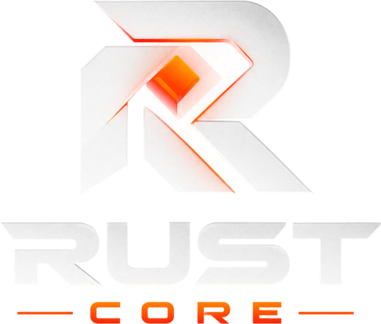

<p align="center">
  
</p>

<h1 align="center">RustCore Launchpad</h1>

<p align="center">
  Launch tokens and NFT collections on the <a href="https://massa.net">Massa</a> blockchain,
  trade NFTs and run token presales — with <b>no backend</b>. A product of the <b>RustCore</b>
  team.
</p>

<p align="center">
  
  
  
</p>

<p align="center">
  <b>Open it:</b>
  <a href="https://lrustcore.massa.network"><b>lrustcore.massa</b></a>
  — live on DeWeb
</p>

---

## Why RustCore Launchpad

Launching a token or an NFT collection shouldn't mean trusting a company with your project or
your money. RustCore Launchpad is built on four principles:

- **You own what you launch.** Your token or collection is deployed with **you** as its owner
  from the first block. The Launchpad keeps no rights over it: it can't mint, pause, freeze or
  change your contract.
- **No backend, no database.** Everything the app shows is read straight from the blockchain:
  one public Launchpad smart contract (the registry, the marketplace, the presales) and the
  contracts it launched. There is no RustCore server to go down, censor or leak data.
- **Everything is verifiable.** Launches use versioned templates whose code is published here
  and whose hash is recorded on-chain. You can download the original code of any launch and
  rebuild it byte for byte. Imported or modified contracts are marked as such.
- **Rules in code, changes in public.** Fees, escrow and refunds are enforced by the contract.
  The Launchpad's own code can only change after a **72-hour public delay**, and its admin can
  never touch presale funds — only the fees collected.

> **Version 1.0.1** ([what's new](CHANGELOG.md)). The Launchpad contract is live
> on Massa **mainnet** at `AS1LbJFfhZpq8DehV7Uw5XQxCyfXtwgUUoiZSTsHcyhEGB7RPWyP`. It has not had
> an independent security audit yet: start with small amounts.

## What you can do

| | |
|---|---|
| 🪙 **Launch a token** | An MRC20 token in one transaction: name, symbol, decimals, supply, optional minting up to a cap, optional burning. You own the contract and the whole supply. |
| 🖼️ **Launch a collection** | An MRC721 NFT collection: metadata on IPFS, owner mint, optional public mint at your price, a per-wallet limit, and a royalty on every sale. |
| 📥 **Import** | List a token or collection you already own and deployed elsewhere. |
| 🛒 **Trade NFTs** | List, buy and cancel on the marketplace. No custody: the NFT stays in your wallet until it's sold. A small marketplace fee and the creator's royalty, nothing else. |
| 🚀 **Run a presale** | Sell your token for MAS with a soft and hard cap. Success: contributors claim their tokens. Failure: they take their MAS back. Nobody can touch the MAS in between. |
| ✏️ **Edit & download** | Change your project's description, logo and links anytime, and download the original contract code as a zip. |
| 🔒 **Mutable or immutable** | Choose at launch whether you can ever upgrade your contract's code. Immutable means nobody — you included — can change it. |

## Getting started

1. **Install a Massa wallet**: [Bearby](https://bearby.io),
   [Massa Station](https://station.massa.net/) or MetaMask with the
   [Massa Snap](https://snaps.metamask.io/snap/npm/massalabs/metamask-snap/). RustCore Wallet
   joins the list once its browser extension can connect to dApps.
2. **Have some MAS** on Massa mainnet for the fees and storage, and keep your wallet on
   mainnet. (Developers can run the app locally against buildnet, the test network — see
   [CONTRIBUTING.md](CONTRIBUTING.md).)
3. **Open the Launchpad** at **`lrustcore.massa`** — click
   [lrustcore.massa.network](https://lrustcore.massa.network) (Massa's official gateway) or open
   `lrustcore.massa` through any DeWeb gateway or [Massa Station](https://station.massa.net/) —
   then click **Connect wallet** and pick your wallet.
4. **Create** a token or a collection from the menu, or browse **Tokens**, **Collections**,
   **Marketplace** and **Presales**. Your launches, NFTs and contributions are under
   **My dashboard**.

The Launchpad is hosted on [DeWeb](https://docs.massa.net/docs/deweb/home), Massa's
decentralized web: its files are stored on-chain, so there is no RustCore web server to take
down or tamper with.

## Fees

The Launchpad charges only five operations; everything else costs only the Massa network fee
and the storage your transaction uses (shown before you sign, the unused part refunded).

| Operation | Fee on mainnet |
|---|---|
| Launch a token | 100 MAS |
| Launch a collection | 200 MAS |
| Import a token or collection | 50 MAS |
| Presale | 2% of the MAS raised, fixed when the presale is created (the contract caps it at 10%) |
| Marketplace sale | 1% of the price, fixed when the NFT is listed and paid from the price (capped at 5%); plus the creator's royalty, at most 10% |

On top of the fee, a launch pays the storage of its new contract (about 4–5 MAS). The values
live in the Launchpad contract (its `config`, readable by anyone) and may change; each
operation shows its cost before you sign, and a change never reaches presales or listings
already created.

## Your security & privacy

**What the Launchpad can and can't do**

- It deploys your contract with you as its owner. After that it can't mint your tokens, move
  your NFTs, change your code or take ownership.
- It holds MAS only in escrow (open presales) and in transit (a purchase pays the seller and
  the royalty in the same transaction). Its admin can withdraw **only the fees collected**: no
  function lets it move escrowed MAS. A presale or a listing keeps the fee in force when it was
  created, so a fee change never reaches them.
- Its admin can mark projects as **verified**, **hide** scams from the lists (their contracts
  keep working), reserve well-known symbols and pause new launches and trading. Refunds,
  claims and cancels keep working while paused.
- A change of the Launchpad's code is announced on-chain and can run only 72 hours later, so
  anyone can see it coming — every page of the app shows a notice while an upgrade is pending.

**What goes over the network — the complete list**

| Destination | Why |
|---|---|
| The DeWeb gateway you open the Launchpad from | Delivers the app itself. Gateways may add their own small "hosted on chain" label to the page, which loads a font from Google Fonts — that's the gateway, not the app. |
| `mainnet.massa.net` / `buildnet.massa.net` | Massa's public nodes: every read, and the transactions you sign. |
| Your wallet | Only after you click **Connect wallet**: the Bearby / MetaMask extensions inside your browser, and Massa Station's local server (`station.massa`, `localhost:8080`). Nothing connects on its own. |
| `ipfs.io` | Public IPFS gateway for `ipfs://` images and NFT metadata. |
| The `https://` addresses project owners chose | Their logos, banners, NFT metadata and images. Requested without a referrer or cookies. |

That's all: no RustCore servers, no analytics, no tracking; fonts are bundled. Links to
`explorer.massa.net` and to project websites open only when you click them. "Download original
code" is built in your browser from files the app ships and the code stored on-chain.

**Built-in safeguards**

- Every transaction is simulated first: if the contract would refuse it, you see why and
  nothing is sent to your wallet. You see what it costs before signing.
- Nothing is shown as done before the chain has executed it.
- A purchase carries the price you saw: if the seller changes it, the purchase is refused.
- Launches go through only with templates whose source code the app ships (checked by hash).
- Images and metadata are shown as images and plain text, never as HTML; only `https://` and
  `ipfs://` links are accepted.

**Good to know**

- **`lrustcore.massa` is the only official address of the Launchpad.** A copy on any other
  address could ask you to sign something else — check the address before connecting your
  wallet. (`rustcore.massa` is the RustCore website, `wrustcore.massa` the RustCore Wallet.)
- **Anyone can launch or import anything.** A token named after a famous project may be a copy:
  check the address, the **Verified** badge and whether the code is **Imported** or
  **Mutable**. A mutable or imported contract can be changed by its owner.
- **A presale is only as good as its token.** The Launchpad guarantees the escrow and the
  refunds; it can't guarantee the project.
- The Launchpad hasn't had an independent audit yet (it's on the [roadmap](#roadmap)).

### Verify it yourself

Releases are [published on GitHub](https://github.com/RustCoreMassa/rust-core-launchpad/releases),
built in public from the source code, with checksums of the app and of the compiled contracts
you can compare against a build of your own and against the code on-chain. See
[how to verify a build](docs/RELEASING.md#verifying-a-build).

## FAQ

**Who owns my token or collection?** You do, from the first block. Your wallet is written as the
contract's owner in its constructor; the Launchpad only keeps a record of it for the lists.

**Can I change my token after launch?** Its presentation (description, logo, links, category)
anytime. Its name, symbol and decimals never. Its code only if you launched it as **mutable** —
and then the Launchpad keeps only your original code: keep any new code yourself.

**What happens to my MAS in a presale?** It stays in the Launchpad contract until the presale
ends. Soft cap reached: you claim your tokens and the owner receives the MAS minus the fee. Not
reached, or cancelled: you take your MAS back with **Refund**.

**Why do transactions send more MAS than the fee?** Massa charges for the storage a transaction
creates (records, balances, the contract itself). The app sends a little more than needed; the
contract refunds the rest in the same transaction.

**Where are my NFT images stored?** Where you put them — usually IPFS. The Launchpad stores only
the links. Pin your files so they stay online.

## Roadmap

**Phase 1 — Launchpad** *(done)*
- [x] Token launch (MRC20 template) and collection launch (MRC721 template)
- [x] Import of existing tokens and collections
- [x] Registry with filters, search and categories — no backend
- [x] NFT marketplace with royalties and a small fee, no custody
- [x] Token presales with escrow, claims and refunds
- [x] Owner dashboard, edits, original-code download
- [x] Admin page, upgrade timelock, internal security review

**Phase 2 — Mainnet** *(done)*
- [x] Mainnet deployment (Launchpad v1.0.0) and fee values
- [x] Published on DeWeb (`lrustcore.massa`)
- [x] Links from the RustCore website

**Later**
- [ ] Presale extras: whitelist, vesting, liquidity on Dusa
- [ ] Token payments on the marketplace
- [ ] An indexer for very large collections
- [ ] Independent security audit
- [ ] RustCore Wallet connection

## Community

Questions, ideas, or want to follow what's next? Join the RustCore community on Telegram:
**[t.me/rustcore_massa](https://t.me/rustcore_massa)**. Admins never message you first and
never ask for your private key — anyone who does is a scammer.

## Support the project

RustCore Launchpad is built in the open. If it's useful to you and you'd like to help fund its
development (an independent audit first), you can send a voluntary donation in MAS or any
Massa token to:

```
AU126s93ZxbT4QUJcZYqsAxyMc3wv8nkHJYKYCtgQyEnZ8VGRM99P
```

Donations are entirely optional and don't unlock any features or lower any fee. Before sending,
always check the address against this README in the official repository — nobody from RustCore
will ever DM you asking for funds or give you a different address.

Not in a position to donate? Starring the repository, reporting bugs and spreading the word help
just as much.

## Contributing

Bug reports, ideas and pull requests are welcome — see [CONTRIBUTING.md](CONTRIBUTING.md) for how
to run the app and the contracts locally, and the rules that keep them safe.

## Security

Found a vulnerability? Please **don't open a public issue** — report it privately through
GitHub's
[private vulnerability reporting](https://docs.github.com/en/code-security/security-advisories/guidance-on-reporting-and-writing-information-about-vulnerabilities/privately-reporting-a-security-vulnerability)
("Report a vulnerability" on the repository's Security tab), with steps to reproduce, and give
us reasonable time to fix it before disclosing it publicly. Funds held by the Launchpad contract
make contract issues the most urgent.

## License

RustCore Launchpad is **source-available** under the
[Functional Source License, Version 1.1, ALv2 Future License](LICENSE.md) (FSL-1.1-ALv2).

In plain words (the [license text](LICENSE.md) is what legally applies):

- ✅ You **may** read, audit, run, modify and share the code — for yourself, for your company's
  internal use, for education and for research.
- ✅ The tokens and collections you launch are **yours**: running, keeping, rebuilding and
  (if you chose mutable code) upgrading your own contract is a permitted use.
- ❌ You **may not** use it to offer a **competing product or service**: a launchpad,
  marketplace or presale platform that substitutes for RustCore Launchpad or offers
  substantially the same functionality.
- ⏳ **Each release becomes open source under Apache-2.0 two years after it is published.**

The names **"RustCore"** and **"RustCore Launchpad"** and the RustCore logo are not licensed for
use in other products, including forks.

Copyright © 2026 Whisky098. All rights reserved except as granted by the license.

## Disclaimer

RustCore Launchpad is provided "as is", without warranty of any kind. Blockchain transactions
are irreversible. Projects launched or imported through the Launchpad are made by their owners,
not by RustCore: a listing, a presale or a **Verified** badge is not investment advice or an
endorsement, and you are solely responsible for what you buy, sell or fund. RustCore is not
affiliated with Massa Labs.
